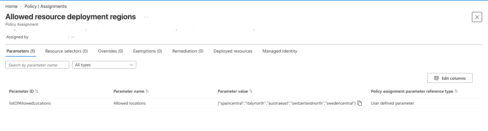

# Linux Command Line CTF Lab - Azure

## Prerequisites

1. [Terraform](https://developer.hashicorp.com/terraform/install) (v1.14.0 or later)
2. [Azure CLI](https://learn.microsoft.com/en-us/cli/azure/install-azure-cli)
3. An Azure account with an active subscription

> [!NOTE]  
> If you have an Azure Student account, you may encounter errors. See the [Azure Student Plan Workaround](#azure-student-plan-workaround) below. If that doesn't resolve it, see [this additional workaround](https://github.com/g-now-zero/l2c-guides/blob/main/posts/ctf-azure-spot-instances-guide.md).

## Getting Started

1. Clone this repository:

    ```sh
    git clone https://github.com/learntocloud/linux-ctfs
    cd linux-ctfs/azure
    ```

2. Log in to Azure:

```sh
az login
```

3. Initialize and apply Terraform:

    ```sh
    terraform init
    terraform apply \
      -var subscription_id="YOUR_AZURE_SUBSCRIPTION_ID" \
      -var az_region="YOUR_AZURE_REGION"
    ```

    Replace the values with your subscription ID and preferred region (defaults to East US).

    Type `yes` when prompted.

    If you run into errors when deploying, see [TROUBLESHOOTING.md](../TROUBLESHOOTING.md) for common issues and fixes.

### VM Size / Capacity Errors

If `terraform apply` fails with `SkuNotAvailable` or quota/capacity errors, the fastest fix is usually switching region and/or VM size.

Defaults for this lab:
- Region: `East US` (`az_region`)
- VM size: `Standard_B1s` (`azure_vm_size`)

Use the full Azure troubleshooting steps here:
- [Azure: SkuNotAvailable / Capacity errors](../TROUBLESHOOTING.md#azure-skunotavailable--capacity-errors)
- [Azure: Quota limit errors](../TROUBLESHOOTING.md#azure-quota-limit-errors)


#### Azure Student Plan Workaround
 
If you're on an Azure Student subscription, these errors are often caused by a policy restricting which regions you're allowed to deploy into, rather than an actual capacity issue.
 
1. In the [Azure Portal](https://portal.azure.com), search for **Policy** and open it.
2. On the left, select **Assignments**.
3. Select **Allowed resource deployment regions** to see the regions your subscription is allowed to deploy into:
    
4. `Standard_B1s` is an older SKU that's gradually being replaced by `Standard_B2ts_v2`. Before changing the region and VM size in the `.tf` file, check whether the new SKU is actually available (and not restricted) in your target region:
```sh
az vm list-skus -l spaincentral -s Standard_B2ts_v2 -o table
```

```text
ResourceType     Locations     Name              Zones    Restrictions
---------------  ------------  ----------------  -------  --------------------------------------------------------------------------
virtualMachines  SpainCentral  Standard_B2ts_v2  1,2,3    NotAvailableForSubscription, type: Zone, locations: SpainCentral, zones: 3
```
 
In this example, `Standard_B2ts_v2` is only unavailable in Zone 3 of Spain Central, every other zone is fine, so it's safe to switch the region and VM size to this combination.

4. Note the `public_ip_address` output—you'll use this to connect.

## Accessing the Lab

1. Connect via SSH:

    ```sh
    ssh ctf_user@<public_ip_address>
    ```

1. On first login you will be asked if you want to add fingerprints to the known hosts file; type `yes` and press Enter.

1. When prompted, enter the password: `CTFpassword123!`

## Starting/Stopping the Lab VM

If you want to pause the lab and reduce cost, use these commands.

Power off the VM:

```sh
terraform apply -invoke=action.azurerm_virtual_machine_power.ctf_power_off
```

Type `yes` when prompted.

Power on the VM:

```sh
terraform apply -invoke=action.azurerm_virtual_machine_power.ctf_power_on
```

Type `yes` when prompted.

Connect again:

```sh
ssh ctf_user@<public_ip_address>
```

> [!NOTE]
> `verify time` uses wall clock elapsed time. If the lab is powered off before you complete and export, powered-off time still counts in elapsed time.

## Cleaning Up

Destroy the resources when you're done to avoid charges:

```sh
terraform destroy
```

Type `yes` when prompted.

## Troubleshooting

1. Ensure your Azure CLI is logged in with valid credentials
2. Check that you're using Terraform v1.14.0 or later
3. Verify you have permissions to create VMs, VNets, and Network Security Groups

If release setup fails during `terraform apply`, Azure reports the failure through the VM Custom Script Extension. Useful VM-side logs are:

```text
/var/log/ctf_setup.log
/var/log/waagent.log
/var/log/azure/custom-script/handler.log
```

If problems persist, please open an issue:

https://github.com/learntocloud/linux-ctfs/issues

Include:
- Azure region
- `terraform version`
- `az account show` output (no secrets)
- The exact `terraform apply` error output (redact any secrets)
- Whether SSH fails or the issue happens after login, such as when running `verify progress`

## Security Note

This lab uses password authentication for simplicity. In production, use key-based authentication.
