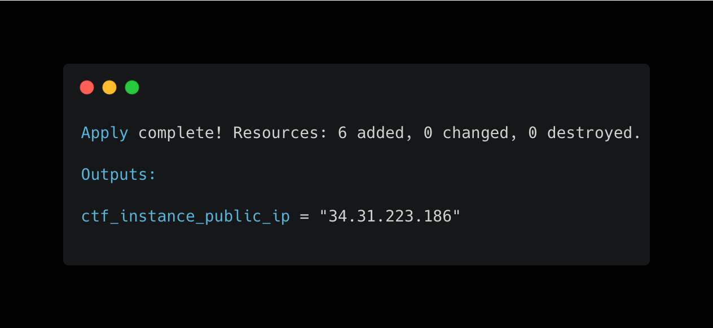
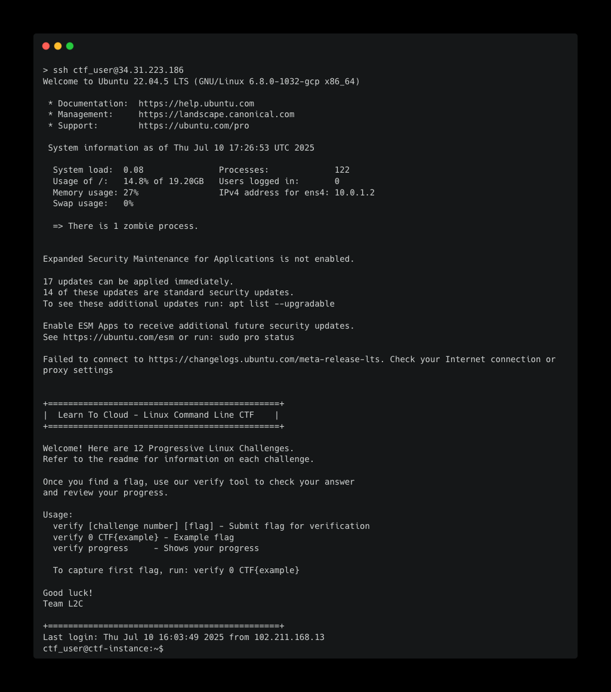

# Linux Command Line CTF Lab - GCP

Welcome to the Linux Command Line Capture The Flag (CTF) lab on Google Cloud! This project sets up a learning environment where you can practice your Linux command line skills by solving various challenges.

## Prerequisites

Before you begin, ensure you have the following installed and configured on your local machine:

1. [Terraform](https://developer.hashicorp.com/terraform/install) (version 1.9.0 or later)
2. [gcloud CLI](https://cloud.google.com/sdk/docs/install)
3. A Google Cloud account with an active project and billing enabled

## How much it's going to cost

If you leave this lab running, it's going to cost you approximately $6-7/month, as it is running an `e2-micro` instance in GCP. Use the `terraform destroy` command to clean up resources once you've completed the CTFs.

## Getting Started

Follow these steps to set up and access your CTF lab environment:

1. Clone this repository to your local machine:

    ``` sh
    git clone https://github.com/learntocloud/ltc-linux-challenge
    cd ltc-linux-challenge/gcp
    ```

2. Log in to Google Cloud using the gcloud CLI:

    ``` sh
    gcloud auth login
    gcloud auth application-default login
    ```

3. Initialize Terraform:

    ``` sh
    terraform init
    ```

4. Apply the Terraform configuration:

    ``` sh
    terraform apply \
    -var gcp_project="YOUR_GCP_PROJECT_ID" \
    -var gcp_region="YOUR_GCP_REGION" \
    -var gcp_zone="YOUR_GCP_ZONE"
   ```

   Replace `YOUR_GCP_REGION` with Google Cloud  Region and `YOUR_GCP_PROJECT_ID` with Google Cloud project that you want to use, by default it uses us-central1 region and us-central1-a zone.

   When prompted, type `yes` to confirm.

5. After the apply completes, note the `public_ip_address` output. You'll use this to connect to your lab environment.


## Accessing the Lab Environment

To access your lab environment:

1. Use SSH to connect to the GCP Instance as the CTF user:

    ``` sh
    ssh ctf_user@<public_ip_address>
    ```

2. When prompted for a password, enter: `CTFpassword123!`
3. Once logged in, you'll see a welcome message with instructions for your first challenge.


## Cleaning Up

When you're done with the lab, don't forget to destroy the GCP resources to avoid unnecessary charges:

`terraform destroy`

Type `yes` when prompted to confirm.

## Security Note

This lab is designed for learning purposes and uses a password-based login for simplicity. In real-world scenarios, key-based authentication is recommended for better security.

## Troubleshooting

If you encounter any issues:

1. Ensure your gcloud CLI is correctly configured with your credentials.
2. Check that you're using a compatible Terraform version.
3. Verify that you have the necessary GCP permissions to create the required resources.

If problems persist, please open an issue in this repository.

Happy learning, and good luck with your CTF challenges!
